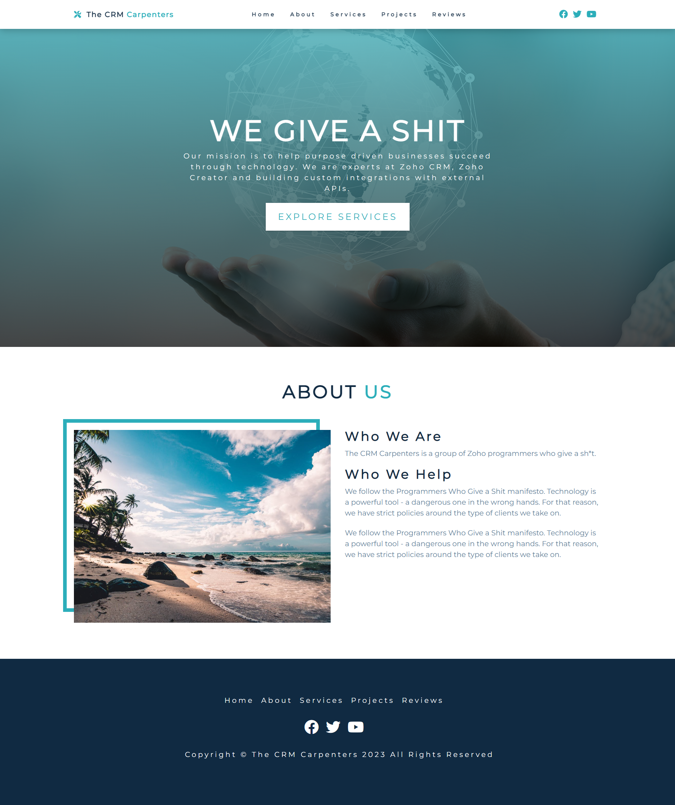
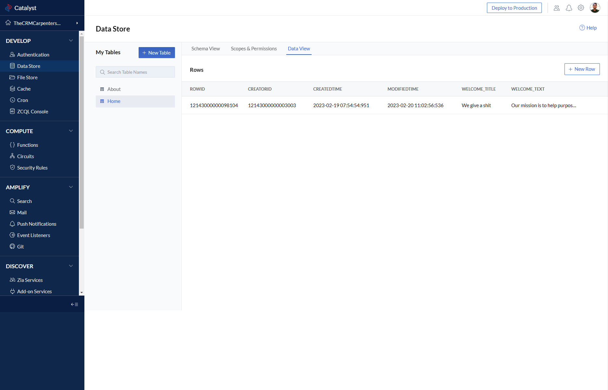

# vjbautista8-zoho-catalyst-the-crm-carpenters-webiste-not-offiicial-webiste-reactJS

This is for learning only. This is not associated in any official website, although the elements are based on http://www.thecrmcarpenters.com

[DEMO LINK](https://thecrmcarpenterswebiste-771945458.development.catalystserverless.com/app/)

## Feature/s

- Using Zoho Catalyst server
- Built with React 18
- Mobile friendly.
- Some elements/components are stored in Zoho Catalyst Data Store

## Screenshot/s

## HOW TO RUN

- cd functions/
- npm install

- cd react-app
- npm install

- cd ..
- catalyst serve
